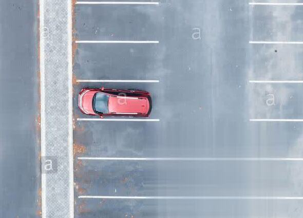

# PCA & Image tracking : A Beautiful love story

## Introduction

> *"It all begins with a simple picture and its subject. The later, lost in the image can't seem to find it **direction**. As it yells for help, a bold hero emerges > from the land of mathematics to rescue, and his name is **PCA**."*

All jokes aside, Mathematics tends to have a beautiful relationship with image processing, and PCA & image tracking is one remarquable example.
In today's post, we'll try to understand the intuition behind **PCA** and its application in **image processing** to find an object's **direction**.

## Isolating the relevant data
Let's take, for instance, the picture of a red car in the middle of parking lot.  

  

